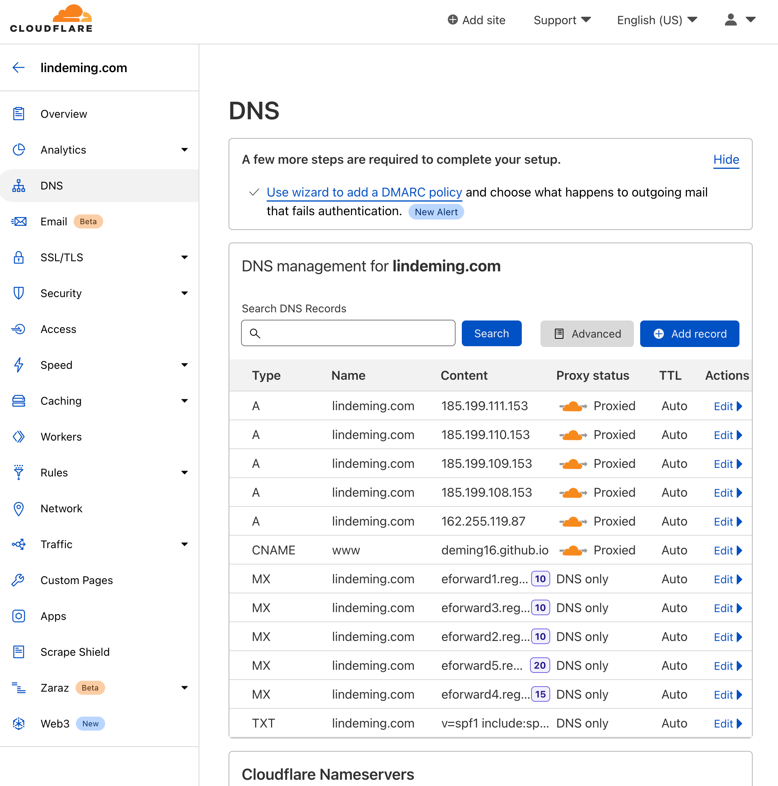

# Personal Online Resume Site

## Setting up

### Cloudflare

Enter the domain `lindeming.com` to access and make sure the settings is as follows

1. In "DNS", make sure sure the following A and CNAME records are created and proxy status is enabled as follows

2. In "Page Rules", make sure there is a page rule with the domain pattern and "Always use HTTPS" rules created as follows

### Namecheap

1. In domain settings, make sure the following cloudflare's nameserve is added as follows

